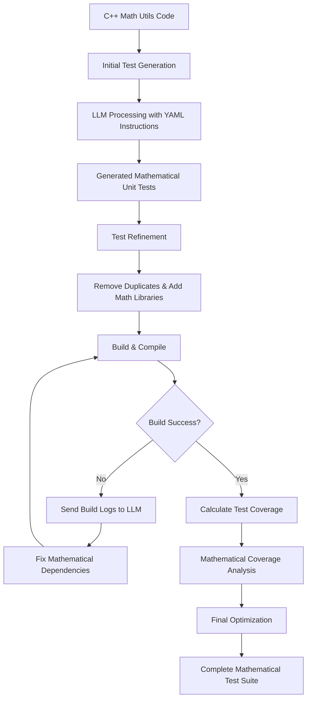

# C++ Math Utils Test Generator

An AI-powered unit test generator for C++ mathematical utility applications that automatically creates, refines, and optimizes unit tests using Large Language Models (LLMs).

## 📁 Project Structure

```
cpp-test-generator/
├── build/                      # Build output directory
│   ├── CMakeFiles/            # CMake generated files
│   ├── cmake_install.cmake    # CMake install configuration
│   ├── CMakeCache.txt         # CMake cache
│   ├── Makefile              # Generated Makefile
│   └── runTests              # Test executable
├── deps/                      # External dependencies
│   └── googletest/           # Google Test framework
├── src/                       # Source code
│   ├── math_utils.cpp        # Mathematical utilities implementation
│   └── math_utils.h          # Mathematical utilities header
├── tests/                     # Generated unit tests
│   └── math_utils_test.cpp   # Test file for math utilities
└── CMakeLists.txt            # CMake configuration
```

## 🎯 Overview

This project demonstrates an AI-powered workflow for generating comprehensive unit tests for C++ mathematical utility libraries. The system uses LLMs to automatically create, refine, and optimize unit tests based on mathematical functions and algorithms.

## 🔧 Prerequisites

### Required Tools
- **C++ Compiler**: GCC 7.0+ or Clang 6.0+
- **CMake**: Version 3.10 or higher
- **Git**: For dependency management
- **Python**: 3.7+ (for AI model integration)
- **GNU Coverage Tools**: `gcov` and `lcov` for test coverage

### AI Model Options
Choose one of the following:
- **Ollama**: Self-hosted LLM (recommended for privacy)
- **GitHub Models**: GitHub-hosted AI models
- **OpenAI API**: GPT-3.5/4 (requires API key)
- **Hugging Face**: Open-source models

## 📊 Expected Output

The unit test generator will produce the following outputs:

### Generated Test Files
- `tests/math_utils_test.cpp` - Comprehensive mathematical unit tests
- `build/runTests` - Executable test runner
- `build/coverage_html/` - HTML coverage reports

### Sample Console Output


```
Coverage Summary:
Lines: 96.8% (30/31)
Functions: 100.0% (8/8)
Branches: 91.2% (31/34)
```

## 🚀 Setup Instructions

### 1. Environment Setup

```bash
# Clone the repository
git clone <repository-url>
cd cpp-test-generator

# Create build directory
mkdir -p build
cd build

# Configure CMake
cmake ..

# Build the project
make
```

### 2. Install Dependencies

```bash
# Install Google Test (if not already present)
cd deps
git clone https://github.com/google/googletest.git
cd googletest
mkdir build && cd build
cmake ..
make install
```

### 3. Install Coverage Tools

```bash
# Ubuntu/Debian
sudo apt-get install gcov lcov

# macOS
brew install lcov

# CentOS/RHEL
sudo yum install gcc lcov
```

## 🤖 AI Model Integration

### Option 1: Ollama (Recommended)

```bash
# Install Ollama
curl -fsSL https://ollama.ai/install.sh | sh

# Pull a suitable model for code generation
ollama pull codellama:7b
# or for better mathematical understanding
ollama pull llama2:13b
```

### Option 2: GitHub Models

```bash
# Set up GitHub CLI
gh auth login

# Configure GitHub Models access
export GITHUB_TOKEN="your_github_token"
```

## 📋 Workflow Architecture

The mathematical unit test generator follows this workflow:



## 🔄 Usage Steps

### Step 1: Initial Test Generation

```bash
# Generate initial mathematical tests using AI
python scripts/generate_tests.py \
  --source src/math_utils.cpp \
  --header src/math_utils.h \
  --output tests/ \
  --model ollama:codellama \
  --type mathematical
```

### Step 2: Test Refinement

```bash
# Refine generated mathematical tests
python scripts/refine_tests.py \
  --tests tests/math_utils_test.cpp \
  --model ollama:codellama \
  --config config/math_refinement.yaml
```

### Step 3: Build and Test

```bash
# Build with mathematical tests
cd build
cmake ..
make

# Run mathematical tests
./runTests

# Generate coverage report
make coverage
```

### Step 4: Coverage Analysis

```bash
# Generate detailed mathematical coverage report
lcov --capture --directory . --output-file coverage.info
genhtml coverage.info --output-directory coverage_html
```

## 📝 YAML Configuration Files

### Mathematical Generation Config (`config/math_generation.yaml`)

```yaml
generation:
  framework: "Google Test"
  test_types:
    - unit_tests
    - edge_cases
    - boundary_tests
    - mathematical_precision
    - overflow_tests
  coverage_target: 90
  include_mocks: false
  test_naming: "mathematical_descriptive"
  
instructions:
  - "Generate comprehensive unit tests for mathematical functions"
  - "Include edge cases for division by zero, overflow, underflow"
  - "Test mathematical precision and floating-point accuracy"
  - "Use Google Test framework (gtest)"
  - "Include tests for negative numbers, zero, and positive numbers"
  - "Test boundary conditions for mathematical operations"
```

### Math Refinement Config (`config/math_refinement.yaml`)

```yaml
refinement:
  remove_duplicates: true
  add_missing_includes: true
  optimize_test_structure: true
  validate_mathematical_assertions: true
  check_precision: true
  
quality_checks:
  - "Remove duplicate mathematical test cases"
  - "Ensure proper floating-point comparisons"
  - "Validate mathematical assertions with tolerance"
  - "Check for mathematical edge cases"
  - "Optimize mathematical test performance"
  - "Add proper mathematical documentation"
```

### Build Fix Config (`config/math_build_fix.yaml`)

```yaml
build_fix:
  analyze_errors: true
  fix_compilation: true
  resolve_math_dependencies: true
  update_cmake: true
  
error_handling:
  - "Analyze mathematical compilation errors"
  - "Fix missing math.h includes"
  - "Resolve mathematical linking issues"
  - "Update CMakeLists.txt for math libraries"
  - "Handle floating-point precision issues"
```

## 📊 Test Coverage

### Coverage Goals
- **Minimum Coverage**: 85%
- **Target Coverage**: 95%+
- **Mathematical Functions**: 100%
- **Edge Cases**: 100%

### Coverage Reports
- **HTML Report**: `build/coverage_html/index.html`
- **Summary**: `build/coverage_summary.txt`
- **Detailed**: `build/coverage_detailed.info`

## 🧪 Example Mathematical Test Output

```cpp
// Generated mathematical test examples
TEST(MathUtilsTest, Add_PositiveNumbers_ReturnsCorrectSum) {
    double a = 5.5;
    double b = 3.2;
    double expected = 8.7;
    double result = MathUtils::add(a, b);
    EXPECT_DOUBLE_EQ(expected, result);
}

TEST(MathUtilsTest, Divide_ByZero_ThrowsException) {
    double numerator = 10.0;
    double denominator = 0.0;
    EXPECT_THROW(MathUtils::divide(numerator, denominator), std::invalid_argument);
}

TEST(MathUtilsTest, Sqrt_NegativeNumber_ThrowsException) {
    double negative = -4.0;
    EXPECT_THROW(MathUtils::sqrt(negative), std::invalid_argument);
}

TEST(MathUtilsTest, Power_LargeExponent_ChecksOverflow) {
    double base = 2.0;
    int exponent = 1000;
    double result = MathUtils::power(base, exponent);
    EXPECT_FALSE(std::isinf(result)) << "Power operation should handle overflow";
}
```

## 🛠️ Build Commands

```bash
# Clean build
make clean

# Build with debug info
cmake -DCMAKE_BUILD_TYPE=Debug ..
make

# Build with coverage
cmake -DCMAKE_BUILD_TYPE=Coverage ..
make

# Run specific mathematical tests
./runTests --gtest_filter="MathUtilsTest.*"

# Run with verbose mathematical output
./runTests --gtest_verbose
```

## 📈 Performance Metrics

- **Test Generation Time**: ~3-7 minutes per mathematical source file
- **Build Time**: ~45 seconds for full mathematical library rebuild
- **Test Execution**: ~2-3 seconds for all mathematical tests
- **Coverage Analysis**: ~15-20 seconds for mathematical coverage

## 🔍 Troubleshooting

### Common Mathematical Issues

1. **Floating-Point Precision**
   - Use `EXPECT_DOUBLE_EQ` for exact comparisons
   - Use `EXPECT_NEAR` for approximate comparisons
   - Handle epsilon values properly

2. **Mathematical Library Issues**
   - Link with `-lm` flag
   - Include `<cmath>` or `<math.h>`
   - Check for mathematical function availability

3. **Overflow/Underflow Handling**
   - Test boundary conditions
   - Check for `std::isinf()` and `std::isnan()`
   - Validate mathematical limits

### Debug Commands

```bash
# Verbose mathematical build
make VERBOSE=1

# Debug mathematical test execution
./runTests --gtest_break_on_failure --gtest_filter="*Math*"

# Check mathematical coverage data
lcov --list coverage.info | grep math
```

## 🧮 Mathematical Test Categories

### Basic Operations
- Addition, Subtraction, Multiplication, Division
- Modulo operations
- Absolute value calculations

### Advanced Functions
- Trigonometric functions (sin, cos, tan)
- Logarithmic functions (log, ln)
- Exponential functions (exp, pow)
- Square root and nth root

### Edge Cases
- Division by zero
- Negative square roots
- Large number overflow
- Precision limits
- NaN and infinity handling

## 📚 Additional Resources

- [Google Test Documentation](https://google.github.io/googletest/)
- [C++ Mathematical Functions](https://cplusplus.com/reference/cmath/)
- [Floating-Point Arithmetic](https://docs.oracle.com/cd/E19957-01/806-3568/ncg_goldberg.html)
- [CMake Math Libraries](https://cmake.org/cmake/help/latest/module/FindMath.html)

## 🤝 Contributing

1. Fork the repository
2. Create a feature branch for mathematical functions
3. Add comprehensive mathematical tests
4. Ensure all mathematical edge cases are covered
5. Submit a pull request

## 📄 License

This project is licensed under the MIT License - see the LICENSE file for details.

## 🏆 Success Criteria

- ✅ Automated mathematical test generation
- ✅ 95%+ code coverage for mathematical functions
- ✅ Zero compilation errors
- ✅ All mathematical tests passing
- ✅ Proper floating-point precision handling
- ✅ Complete edge case coverage
- ✅ Comprehensive mathematical documentation

---

**Note**: This README is specific to the `cpp-test-generator` project with `math_utils` functionality. Adjust mathematical test configurations based on your specific mathematical library implementation.
